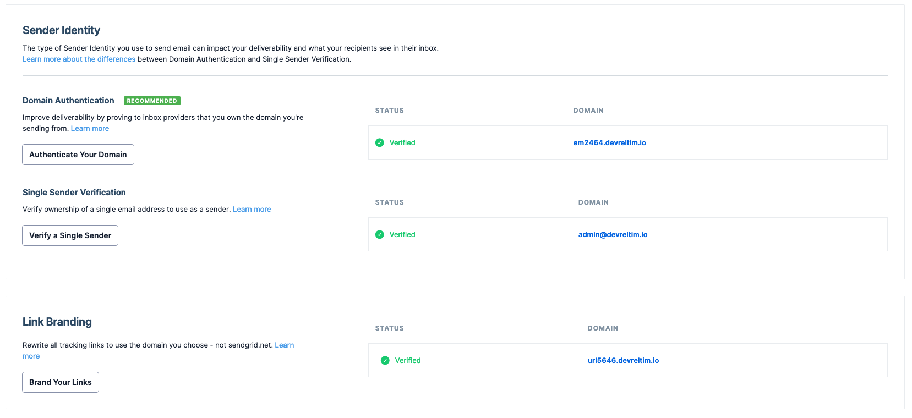

# Supabase on AWS - Terraform

> _IMPORTANT:_ A note on secrets/tokens/apis and the `terraform.tfstate` file. Ensure that any files containing secrets/tokens/apis as well as the `terraform.tfstate` file are _NOT_ stored in version control.

This is where most of the magic will happen as all you need to do is configure your variables and run 3 _(2 if you're confident in what is happening)_ commands.

```bash
## From the root of the repository change directory to the terraform directory
cd terraform

## Copy the example file to terraform.tfvars, modify it with your own variables and save
cp terraform.tfvars.example terraform.tfvars
```

A list of required variables, as well as optional variables with their default values, is documented below. Go through the list and modify the `terraform.tfvars` accordingly with your own values.

After creating the variables run the following commands to deploy the resources:

```bash
## Initialise terraform to download any plugin binaries needed
terraform init

## Create and show a plan of what will be created
## (skip if you want to apply immediately)
terraform plan

## Apply the changes specified by confirming at the prompt
## (--auto-approve if you're feeling adventures)
terraform apply
```

Once all the resources have been created you'll see the following message (the bucket name, volume id and elastic IP will obviously be different):

```
Apply complete! Resources: 24 added, 0 changed, 0 destroyed.

Outputs:

s3_bucket = "supabase-1a2b3c4d5e6f7g8h"
ebs_volume_id = "vol-1234567890abcdef0"
htpasswd = <sensitive>
jwt = <sensitive>
jwt_anon = <sensitive>
jwt_service_role = <sensitive>
psql_pass = <sensitive>
elastic_ip = "123.456.789.000"
sendgrid_generated_api = <sensitive>
```

As the SendGrid Single Sender, Domain Authentication and Link Branding resources are created before the domain records are created, we need to verify them before being able to send emails via SendGrid. You can either use SendGrid's UI, within Settings > Sender Authentication of your account to manually verify them or rerun the apply command.

```bash
## Re-apply terraform to verify SendGrid resources
terraform apply
```

Within SendGrid's UI you should now have green ticks showing that all the resources have been verified.
_N.B. Updates to your nameservers with your domain registrar and records within Route53 can take up to 48 hours to propagate (unlikely but possible)._



You'll need to grab the passwords and tokens generated by terraform to access and make use of the system. To do this run the following commands (**_AGAIN ensure you do not store secrets in version control_**)

```bash
## Show the generated auth password
terraform output htpasswd

## Show the generated psql password
terraform output psql_pass

## Show the generated jwt secret and tokens
terraform output jwt
terraform output jwt_anon
terraform output jwt_service_role
```

Now take a **5-10 min** break and grab a coffee, cup of tea, etc. The EC2 instance needs time to download all the containers, extract them, configure SSL certs and more (I'm not kidding, the supabase-db container alone is over 1GB to download and when extracted is over 2GB).

After taking a well deserved little break go to your browser and input the supabase domain in the format `supabase.${your-domain}` (if using Route53) or the EC2 instance's public DNS. A pop-up appears asking you to enter your authentication details (your provided username and the generated htpasswd).

You're done!!! You've now got a secure supabase self-hosted system running on AWS with persistent storage.

Enjoy and Happy creating :)

## Terraform file structure

This terraform directory has multiple files to create the wanted architecture:

```bash
.
├── ec2.tf                        # EC2 instance resource that is created from the specified AMI
├── files                         # Directory with templated files
│   ├── .env.tftpl                # environment variable file to be used by docker-compose
│   ├── .htpasswd.tftpl           # auth credentials for nginx basic authentication
│   ├── kong.yml.tftpl            # kong configuration file
│   └── sender-verification.sh.tmpl   # script to create single sender verification on SendGrid
├── locals.tf                     # terraform locals that are used within other resources (also creates passwords/tokens)
├── network.tf                    # VPC, Subnet, Security Groups, and Route53 configuration
├── outputs.tf                    # outputs required computed variables (will also output sensitive information in the tfstate file)
├── provider.tf                   # sets up all the providers and requirements to run terraform
├── sendgrid.tf                   # setups SendGrid single sender verification, domain authentication and link branding
├── storage.tf                    # creates an EBS volume to attach to the EC2 instance and an S3 bucket for object storage
├── terraform.tfvars.example      # example tfvars file, copy and modify as specified above
└── variables.tf                  # terraform variable definitions and requirements
```

I won't be going into the specifics of each and every file, but if you have any questions or comments do not hesitate to reach out.

**_What's happening in the background_**

When you confirm the output of the `terraform apply` command (or if you were feeling adventures, after hitting return on the `terraform apply --auto-approve` command), terraform creates a dependency graph to determine in which order to create resources.

### A note about securing the EC2 instance and S3

The Security Group opens Ports 80 and 443 for general web interaction and also Port 22 to be able to SSH into the EC2 instance. We highly suggest that you SSH into the EC2 instance by using an SSH key and that you restrict the IPs that can SSH into it by setting the `ssh_cidr_blocks` variable.

A policy for the S3 bucket is created during the creation process. This policy can be restricted to only allow access to the bucket via the EC2 instance's IP and IPs specified in `ssh_cidr_blocks` (if populated) by setting the `s3_restrict_access` variable to `true` (default `false`). If you do set the `s3_restrict_access` variable to `true` be aware that you won't be able to access artifacts in the bucket via AWS's Console (If needed you can set the variable back to `false` and run `terraform apply` again).

### A note about the SendGrid Provider

The SendGrid Provider is not an official provider (which is fine, we [Love](https://www.digitalocean.com/about) Open Source). This does mean that it does not fully support SendGrid's api currently. Which is why a [_hack_](./sendgrid.tf) has been implemented to automate the creation of the Single Sender Verification. If one of the providers ever supports this functionality this will be implemented for robustness, until then we have to make way for this _hack_. Regarding this please note the comment about destroying this resource (or lack of ability to do this currently).

### A note on destroying

Should you wish to destroy the resources created all you need to do is run the destroy command (makes sense).

```bash
## Destroy the resources specified by confirming at the prompt
## (as with apply you can --auto-approve if you're feeling adventures)
terraform destroy
```

If you have any artifacts stored in your S3 bucket the terraform destroy command will partly fail warning that the bucket cannot be destroyed. To destroy it you'll have to first remove all artifacts within the bucket and re-run `terraform destroy`.

Also Terraform won't destroy the Single Sender created in SendGrid (told you it was a hack), so you'll have to manually delete this yourself via SendGrid's UI.

## Terraform documentation

- Providers, Inputs and Outputs will be automatically documented using pre-commit hooks in the `README.md` file
  - To automatically create the documentation you need to install the hooks as described below
- The subdirectory has a `terraform.tfvars.example` file holding example values for variables required to implement the infrastructure.

### Hooks

Install `pre-commit` and `terraform-docs` (on MacOS, Homebrew has formulae for both).
Then run the `pre-commit install` command to install the pre-commit hooks specified.

<!-- BEGINNING OF PRE-COMMIT-TERRAFORM DOCS HOOK -->
## Providers

| Name | Version |
|------|---------|
| <a name="provider_aws"></a> [aws](#provider\_aws) | ~> 5.0 |
| <a name="provider_cloudinit"></a> [cloudinit](#provider\_cloudinit) | 2.2.0 |
| <a name="provider_htpasswd"></a> [htpasswd](#provider\_htpasswd) | 1.0.4 |
| <a name="provider_jwt"></a> [jwt](#provider\_jwt) | 1.1.0 |
| <a name="provider_random"></a> [random](#provider\_random) | 3.4.3 |
| <a name="provider_sendgrid"></a> [sendgrid](#provider\_sendgrid) | 0.2.0 |
| <a name="provider_time"></a> [time](#provider\_time) | 0.9.1 |

## Inputs

| Name | Description | Type | Default | Required |
|------|-------------|------|---------|:--------:|
| <a name="input_auth_user"></a> [auth\_user](#input\_auth\_user) | The username for Nginx authentication. | `string` | n/a | yes |
| <a name="input_region"></a> [region](#input\_region) | The AWS region where resources will be created. | `string` | n/a | yes |
| <a name="input_domain"></a> [domain](#input\_domain) | Domain name where the Supabase instance is accessible. Required only if use_route53 is true. When use_route53 is false, the EC2's public DNS will be used instead. | `string` | `""` | no |
| <a name="input_site_url"></a> [site\_url](#input\_site\_url) | Domain name of your application in the format. | `string` | n/a | yes |
| <a name="input_timezone"></a> [timezone](#input\_timezone) | Timezone to use for Nginx (e.g. Europe/Amsterdam). | `string` | n/a | yes |
| <a name="input_smtp_admin_user"></a> [smtp\_admin\_user](#input\_smtp\_admin\_user) | `From` email address for all emails sent. | `string` | n/a | yes |
| <a name="input_smtp_addr"></a> [smtp\_addr](#input\_smtp\_addr) | Company Address of the Verified Sender. Max 100 characters. If more is needed use `smtp_addr_2` | `string` | n/a | yes |
| <a name="input_smtp_city"></a> [smtp\_city](#input\_smtp\_city) | Company city of the verified sender. | `string` | n/a | yes |
| <a name="input_smtp_country"></a> [smtp\_country](#input\_smtp\_country) | Company country of the verified sender. | `string` | n/a | yes |
| <a name="input_instance_type"></a> [instance\_type](#input\_instance\_type) | The EC2 instance type. | `string` | `"t3.small"` | no |
| <a name="input_instance_backups"></a> [instance\_backups](#input\_instance\_backups) | Boolean controlling if backups are made. Defaults to true. | `bool` | `true` | no |
| <a name="input_ssh_pub_file"></a> [ssh\_pub\_file](#input\_ssh\_pub\_file) | The path to the public key ssh file. | `string` | `""` | no |
| <a name="input_tags"></a> [tags](#input\_tags) | A map of tags to be added to all resources. | `map(string)` | `{}` | no |
| <a name="input_volume_size"></a> [volume\_size](#input\_volume\_size) | The size of the EBS volume in GiB. If updated, can only be expanded. | `number` | `25` | no |
| <a name="input_enable_ssh"></a> [enable\_ssh](#input\_enable\_ssh) | Boolean enabling connections to EC2 instance via SSH by opening port 22 on the security group. | `bool` | `true` | no |
| <a name="input_ssh_cidr_blocks"></a> [ssh\_cidr\_blocks](#input\_ssh\_cidr\_blocks) | List of CIDR blocks from which SSH access is allowed. | `list(string)` | `["0.0.0.0/0"]` | no |
| <a name="input_enable_db_con"></a> [enable\_db\_con](#input\_enable\_db\_con) | Boolean enabling connections to database by opening port 5432 on the security group. | `bool` | `false` | no |
| <a name="input_db_cidr_blocks"></a> [db\_cidr\_blocks](#input\_db\_cidr\_blocks) | List of CIDR blocks from which database access is allowed. | `list(string)` | `["0.0.0.0/0"]` | no |
| <a name="input_s3_restrict_access"></a> [s3\_restrict\_access](#input\_s3\_restrict\_access) | Boolean signifying whether to restrict the S3 bucket to the EC2 instance and specified IPs or allow all IPs. | `bool` | `false` | no |
| <a name="input_studio_org"></a> [studio\_org](#input\_studio\_org) | Organization for Studio Configuration. | `string` | `"Default Organization"` | no |
| <a name="input_studio_project"></a> [studio\_project](#input\_studio\_project) | Project for Studio Configuration. | `string` | `"Default Project"` | no |
| <a name="input_vpc_id"></a> [vpc\_id](#input\_vpc\_id) | ID of the VPC where resources will be created. | `string` | `""` | no |
| <a name="input_subnet_id"></a> [subnet\_id](#input\_subnet\_id) | ID of the subnet where the EC2 instance will be launched. | `string` | `""` | no |
| <a name="input_ami_id"></a> [ami\_id](#input\_ami\_id) | ID of the AMI to use for the EC2 instance. | `string` | `""` | no |
| <a name="input_certificate_arn"></a> [certificate\_arn](#input\_certificate\_arn) | ARN of the ACM certificate to use for HTTPS. | `string` | `""` | no |
| <a name="input_enable_sendgrid"></a> [enable\_sendgrid](#input\_enable\_sendgrid) | Boolean controlling if SendGrid integration is enabled. | `bool` | `false` | no |
| <a name="input_use_route53"></a> [use\_route53](#input\_use\_route53) | Boolean controlling if Route53 is used for DNS management. | `bool` | `false` | no |

## Outputs

| Name | Description |
|------|-------------|
| <a name="output_s3_bucket"></a> [s3\_bucket](#output\_s3\_bucket) | The unique name of the S3 bucket in the format `supabase-ab12cd34ef56gh78`. |
| <a name="output_ebs_volume_id"></a> [ebs\_volume\_id](#output\_ebs\_volume\_id) | The unique identifier for the EBS volume attached to the EC2 instance. |
| <a name="output_htpasswd"></a> [htpasswd](#output\_htpasswd) | Randomly generated 32 character password for authentication via Nginx. |
| <a name="output_jwt"></a> [jwt](#output\_jwt) | Randomly generated 40 character jwt secret. |
| <a name="output_jwt_anon"></a> [jwt\_anon](#output\_jwt\_anon) | The HS256 generated jwt token for the `anon` role. |
| <a name="output_jwt_exp"></a> [jwt\_exp](#output\_jwt\_exp) | The Expiration time for the `anon` and `service_role` jwt tokens in epoch time. |
| <a name="output_jwt_iat"></a> [jwt\_iat](#output\_jwt\_iat) | The Issued At time for the `anon` and `service_role` jwt tokens in epoch time. |
| <a name="output_jwt_service_role"></a> [jwt\_service\_role](#output\_jwt\_service\_role) | The HS256 generated jwt token for the `service_role` role. |
| <a name="output_psql_pass"></a> [psql\_pass](#output\_psql\_pass) | Randomly generated 32 character password for the Postgres database. |
| <a name="output_elastic_ip"></a> [elastic\_ip](#output\_elastic\_ip) | The Elastic IP assigned to the EC2 instance. |
| <a name="output_sendgrid_generated_api"></a> [sendgrid\_generated\_api](#output\_sendgrid\_generated\_api) | SendGrid API key to allow sending of emails (The api key is limited to Send Mail scope only). |
| <a name="output_instance_id"></a> [instance\_id](#output\_instance\_id) | The ID of the EC2 instance. |
| <a name="output_instance_public_dns"></a> [instance\_public\_dns](#output\_instance\_public\_dns) | The public DNS of the EC2 instance. |
| <a name="output_supabase_url"></a> [supabase\_url](#output\_supabase\_url) | The URL to access Supabase. |
| <a name="output_access_instructions"></a> [access\_instructions](#output\_access\_instructions) | Instructions on how to access Supabase. |
  <!-- END OF PRE-COMMIT-TERRAFORM DOCS HOOK -->
